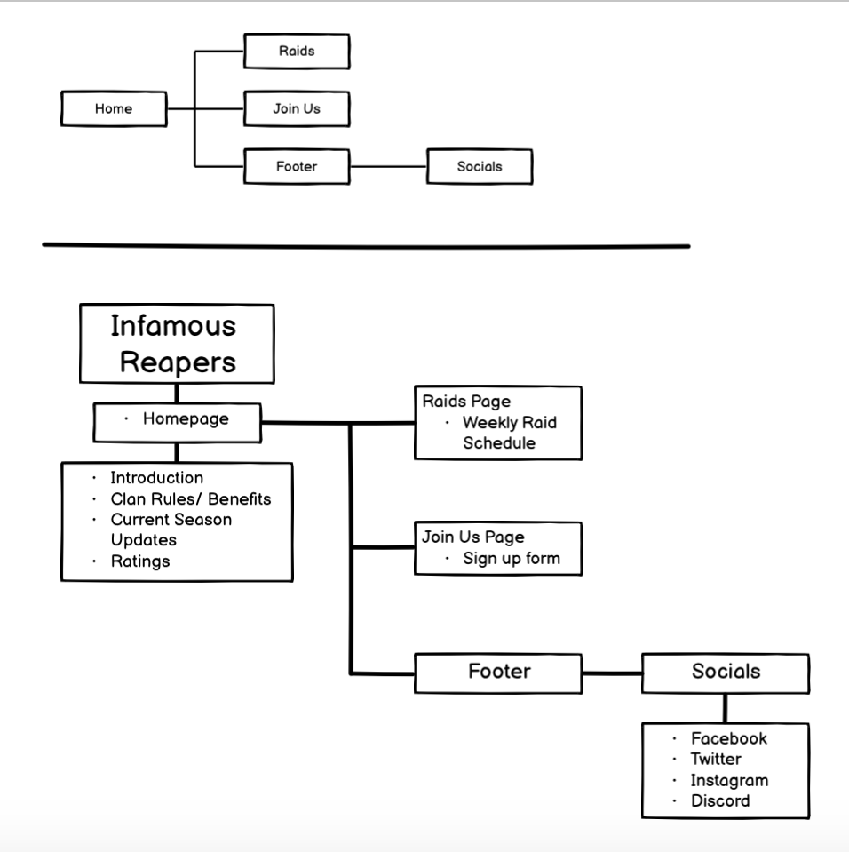
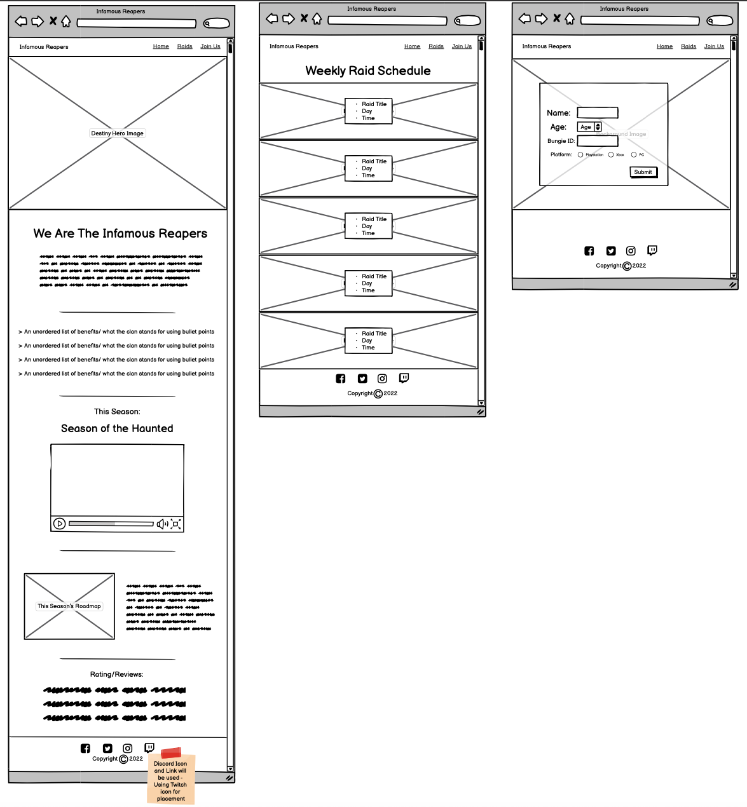
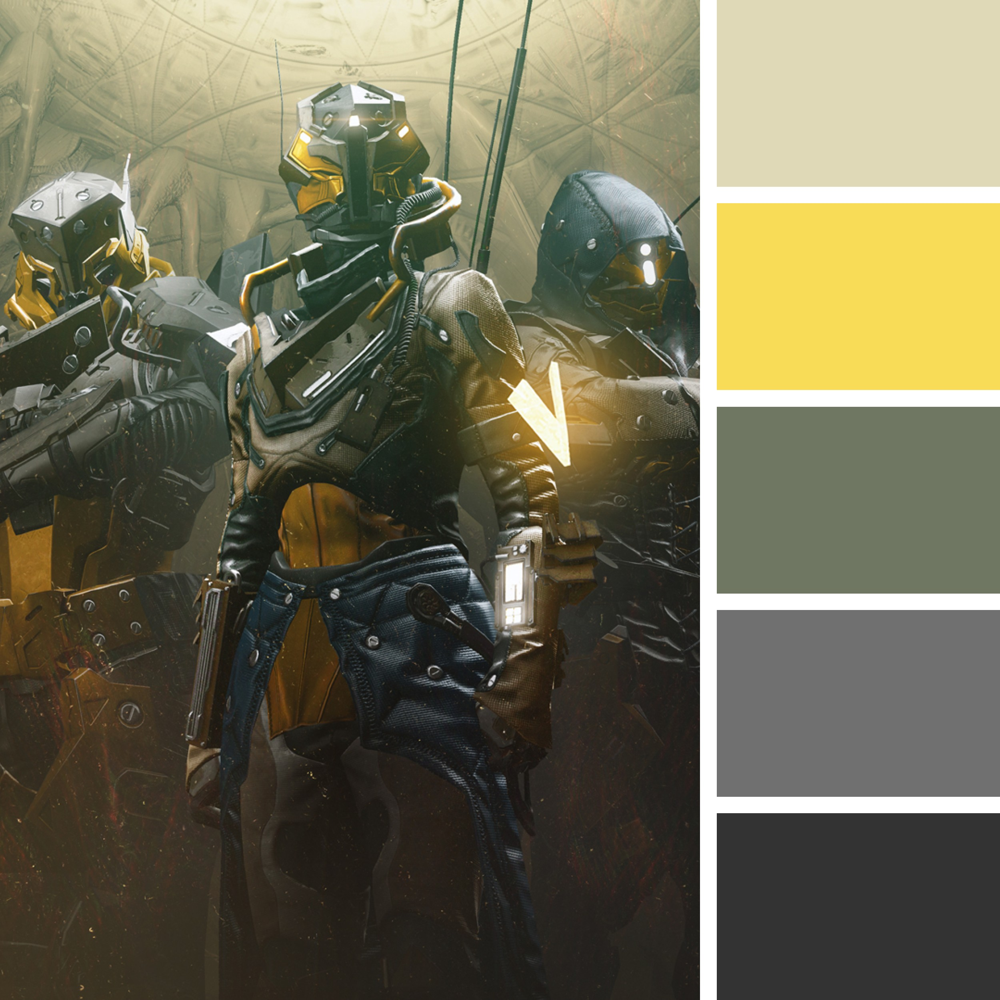

# Infamous Reapers

# Table of contents
1. [Introduction](#Introduction)
    - [Requirements](#Requirements)
2. [UX](#UX)
    - [Target User Demographic](#target-user-demographic)
3. [Development Plan](#development-plan) 
    - [Strategy](#strategy)
4. [Design](#design)
    - [Structure](#structure)
    - [Skeleton](#skeleton)
    - [Colour Scheme](#colour-scheme)
    - [Typography](#typography)
    - [Media](#media)
5. [Features](#features)
    - [Current Features](#current-features)
    - [Future Features](#future-features)
6. [Testing](#testing)
    - [Issues & Bugs](#issues-&-bugs)
7. [Deployment](#deployment)
8. [Technologies Used](#technologies-used)
9. [Credits & Acknowledgements](#credits-&-acknowledgements)

## Introduction

This website was designed and created to advertise a gaming clan that is looking for new members to be apart of the Destiny 2 community.

This site is based on a gaming group that congragates online, daily to play Destiny 2 and help one another with different quest and challenges. This group is open and looking for fellow Guadians, bot rookie and veterans alike to join them in the mythic science fiction world of Destiny, which is an FPS (first-person shooter) multiplayer video game which is developed by Bungie, where Guardians of all races come together to protect the Light from Darkness which seeks to steal it at every turn.

This website was the first of the five milestone projects that is required for the completion of the Code Institute's Full Stack Software Development Course.

### Requirements:
To build a responsive, static front-end website. This should present useful information to the user, using the required technologies of HTML5 and CSS3 that have been taught in the course so far. The data presented should help the user learn about the services it intends to provide as well as market and present a service for the site owner.

## UX

### Target User Demographic:
The target demographic for the site:
- 'Destiny' veterans
- New comers to 'Destiny'
- Casual Gamers

#### 1. 'Destiny' Veterans Goals:
- For 'Destiny' Veterans, to find a community to play with.
- To easily navigate through the site to understand what the clan is about and their intentions 
- Up to date content that is relevant to the current season updates

#### 2. New comers to 'Destiny' Goals:
- For new comers to 'Destiny' to be able to understand what a clan is and its purpose.
- To be able to find all relevant information on the game and current season update to be found with little to no difficulty as a new comer to both the site and the game.
- To be able to join the clan with little to no difficulty through simple navigation

#### 3. Casual Gamers of 'Destiny' Goals:
- For casual gamers of 'Destiny' to understand the purpose of the clan and the what they do. 
- To see a simple layout/ stucture to the site that is easily navigated to find relevant infor mation about the clan
- To see relevant information on why this clan is best suited for them

## Development Plan

### Strategy:

To build a site that achieves the users goals, the developer needs to incorporate most, if not all the aspects the user is looking for by making sure the site is true to the identity of the game as well as the clan itself. The stategy will incorporate the users needs/ goals as well as site objectives.

**Users:**
- New users
- Current users
- Avid Destiny 2 players
- Beginners to Destiny 2

**Target Demographic:**
- From age 16 upwards
- Gamers
- Gamers that play Destiny 2

**Psychographic:**
- Lifestyle: 
    - Casual gamers
    - Avid/ Hardcore gamers
- Social Status:
    - Ambivert
    - Introvert
    - Extrovert
- Values:
    - Equality
    - Community 
    - Respect

The site needs to provide the following to the user:
- Information on the clan
- Type of clan, whether it be competitive or casual
- Up to date information on the current season of Destiny 2
- Scheduling information 
- How to get involved
- Ways of keeping connected 

The site needs to provide the following to the manager:
- Collect user entries to join the clan

## Design

### Structure:

In order to create the website, a site map has been constructed on the basis of a the basic structure to a website. This shows how the user will navigate through the site with ease and with very little to no difficulty:

### Template:

In order to create the main template (Wireframe) of the site, the appearance and aesthetics of the site had to be thought out whilst giving the user a positive experience alongside simple navigation.

### Colour Scheme:

The colour scheme inspired by the the main image that is from Destiny 2:

In order to create the color palette, [Coolors](https://coolors.co/collage-maker) collage maker was used. The color scheme itself is quite muted intentionally to stay on theme with the identity of 'Destiny 2'.
Most of the written content is in a dark charcoal [#333333](#333333)to keep the written content as clear as possible and non-distracting.
A bright yellow [#F8DC57](#F8DC57) has selected to for the written content of the Benefits list against the grey background [#707070](#707070) to give it a higher level of importance in comparison to the standard written content on the page.

### Typography:

The main font used for the site is [Kanit](https://fonts.google.com/?query=kanit) and the back up font applied will be Sans-Serif should there be any issue with the font uploading.
[Kanit](https://fonts.google.com/?query=kanit) was chosen to for overall font to keep evyerything uniform. It was also chosen to resembe the font used for the game (Destiny 2) itself, so that it ties in together.

### Media:

The imagery used has been sorced from a selection of webites in relation to 'Destiny 2'. 
A single clip has been used to introduced and reperesent what is happening in the current season.

## Features

### Current Design Features:
- **Header** - appears on every page with clan logo
- **Navigation Bar** - appears at the top of every page along with the logo in the header to allow for easy navigation 

Both the Header and Navigation Bar are a fused feature on the site -[Header/ Nav Bar]('site-features/header.jpg')

- **Footer** - appears at the bottom of the bottom of every page, featuring social media icons (4), as links to keep the aesthetic clean and simple
[Footer]('site-features/footer.jpg')

- **Embeded Clip** - a clip relating to the content has been embeded to provide additional information on the current season of the game relating to the content
[Embedded Clip]('site-features/clip.jpg')

- **'Join Us' Form** - a form has been added to the join us page to allow the user to join the clan with as much clarity as possible
[Form]('site-features/form.jpg')

### Future Features:
Future design fetaures that could be incorporated:
- Attach sign up forms to the raid schedule
- Create a page to help with sub class set up, to provide more giudance to new comers
- Create a 'Thank you for joining page' for when the form is submitted to join the clan

The features above have not been implemented in the main release of the site due to lack of time to complete the page/ pages running up to submission.

## Issues & Bugs

- Struggled to position the Iframe (YouTube clip) and to allow it to be responsive
  - Used a div tag to center the iframe

  

### Testing

- Each page had gone through the [W3C Validator](https://validator.w3.org/) in order to make any bugs or erros that have been missed whilst building the site are caught before submission.

* [Home Page Results]('testing/index.html-result.jpg')

* [Raid Schedule Page]('testing/raids.html-result.jpg')

* [Join Us Page]('testing/joinus.html-result.jpg')

* [CSS Styling Page]('testing/css-styling-result.jpg')

After validating each page used for the site, no syntax errors are present.

Device Testing:
- Google Chrome Developer tools were use to test the responsiveness of the site on different devices such as:
   - Apple iPad Air
   - Apple iPad Mini
   - iPhone SE
   - iPhone XR
   - Pixel 5
   - Samsung Galaxy S8+
   - Nest Hub
   - Nest Hub Max

## Deployment

The following project had been produced and developed using GitPod, which has then been commited and pushed to GitHub.

## Technologies Used

### Main Languages:
- HTML5
- CSS3

### Programs Used:
- [GitPod](https://www.gitpod.io/) - used to write the code, commit and then push to GitHub
- [GitHub](https://github.com/) - used to store the code/ project after being pushed from GitPod
- [Balsamiq](https://balsamiq.com/wireframes/) - used to create Wireframes throughout the design process 
- [Font Awesome](https://fontawesome.com/) - used for all the icons on each page (e.g social media icons for the footer)
- [Google Fonts](https://fonts.google.com/) - used throughout the site for the font which has been imported into the style.css file

## Credits & Acknowledgements
